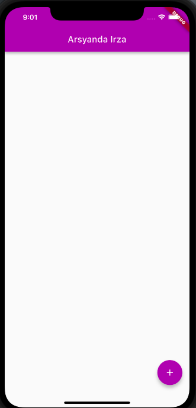
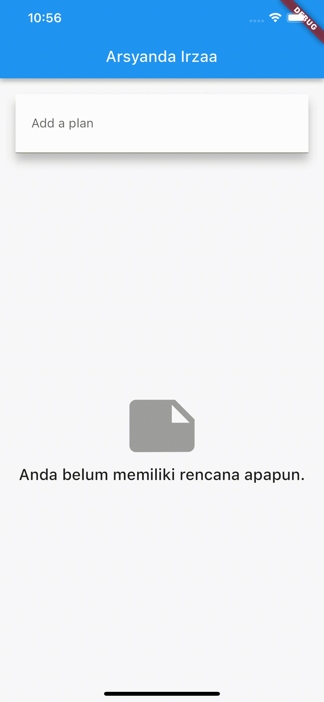

# Nama : Arsyanda Irza Rabbani Yuardhino
# Kelas : TI-3F
# Nim : 2141720245
# WEEK 11

## Tugas Praktikum 1 (Langkah 9): Run atau tekan F5 untuk melihat hasil aplikasi yang Anda telah buat. Capture hasilnya untuk soal praktikum nomor 4.

## Tugas Praktikum 1: Dasar State dengan Model-View
### 1. Selesaikan langkah-langkah praktikum tersebut, lalu dokumentasikan berupa GIF hasil akhir praktikum beserta penjelasannya di file README.md!

### 2. Jelaskan maksud dari langkah 4 pada praktikum tersebut! Mengapa dilakukan demikian?

jadi, data_layer digunakan untuk menyimpan importan dari file plan.dart dan task.dart untuk dipanggil ke plan_screen agar hanya mengimport data_layer saja

### 3. Mengapa perlu variabel plan di langkah 6 pada praktikum tersebut? Mengapa dibuat konstanta ?

variabel plan dibuat untuk menyimpan objek Plan yang digunakan dalam kelas PlanScreen. Dalam langkah ini, variabel plan diberi nilai default sebagai objek Plan kosong dengan bantuan konstruktor konstan. Dengan memberikan nilai awal dan mengkonstankan objek Plan, kita membuatnya menjadi read-only dan menjaga nilai tetap tidak berubah setelah inisialisasi. Dalam praktikum ini, ini berguna untuk memulai dengan rencana kosong dan membangun fungsi-fungsi untuk menambah dan mengubah rencana serta tugasnya.

### 4. Lakukan capture hasil dari Langkah 9 berupa GIF, kemudian jelaskan apa yang telah Anda buat!

Pada langkah 9, saya telah membuat metode _buildTaskTile, yang digunakan untuk membuat item tampilan untuk setiap tugas yang tercantum dalam rencana. Ini adalah tampilan yang memungkinkan pengguna untuk melihat tugas apakah sudah selesai atau belum dengan melihat checkbox diisi atau tidak. untuk gif bisa dilihat di soal no 1

### 5. Apa kegunaan method pada Langkah 11 dan 13 dalam lifecyle state ?

- Langkah 11 (initState()): Method initState() digunakan untuk melakukan inisialisasi state pada widget. Pada langkah ini, sebuah ScrollController dideklarasikan dan dimulai dengan menambahkan listener. Fungsinya adalah untuk mengatur perilaku ketika terjadi event scroll pada ListView, khususnya untuk menghapus fokus dari semua TextField ketika terjadi scrolling. Ini membantu untuk menghindari masalah interaksi pengguna saat keyboard muncul dan sekaligus memastikan pengalaman pengguna yang lebih baik.

- Langkah 13 (dispose()): Method dispose() merupakan bagian dari siklus hidup widget dan digunakan untuk membersihkan dan melepaskan sumber daya sebelum widget dihancurkan. Pada langkah ini, scrollController dihentikan dan dibersihkan. Tujuannya adalah untuk menghindari memory leaks atau masalah kinerja dengan memastikan bahwa sumber daya yang digunakan widget dihentikan dengan benar saat widget tidak lagi digunakan.

## Tugas Praktikum 2: InheritedWidget
### 1. Selesaikan langkah-langkah praktikum tersebut, lalu dokumentasikan berupa GIF hasil akhir praktikum beserta penjelasannya di file README.md!
</img>

### 2. Jelaskan mana yang dimaksud InheritedWidget pada langkah 1 tersebut! Mengapa yang digunakan InheritedNotifier?

inheritedWidget di langkah 1 adalah 
return context.
    dependOnInheritedWidgetOfExactType<PlanProvider>()!.notifier!;
InheritedNotifier digunakan karena ia menyediakan kemampuan untuk mempublikasikan notifikasi saat terjadi perubahan pada data yang dipantau. Dalam konteks ini, PlanProvider menggunakan ValueNotifier untuk mengatur perubahan pada data Plan. Dengan demikian, saat terjadi perubahan pada data Plan, PlanProvider akan memberi tahu widget-widget di bawahnya yang menggunakan data tersebut untuk melakukan rebuild

### 3. Jelaskan maksud dari method di langkah 3 pada praktikum tersebut! Mengapa dilakukan demikian?

int get completedCount: Method ini menghitung jumlah tugas yang telah selesai dalam rencana (plan) dengan menggunakan method where pada list tasks dan menghitung berapa jumlah tugas yang memiliki atribut complete bernilai true.

String get completenessMessage: Method ini menghasilkan pesan yang menyatakan seberapa banyak tugas yang telah diselesaikan dari total tugas dalam rencana (plan). Pesan ini mengambil informasi dari method sebelumnya (completedCount) dan menampilkan pesan berformat yang menyatakan jumlah tugas yang sudah selesai dari total tugas.

Penambahan kedua method ini berguna untuk menyediakan informasi tambahan terkait dengan rencana yang sedang ditampilkan, seperti memberikan informasi seberapa banyak tugas yang telah diselesaikan

### 4. Lakukan capture hasil dari Langkah 9 berupa GIF, kemudian jelaskan apa yang telah Anda buat!

SafeArea Menempatkan teks plan.completenessMessage di bagian bawah layar, di luar daftar tugas. Ini memastikan bahwa teks tersebut tidak tertutup oleh elemen UI lainnya, seperti tombol navigasi sistem atau area status di perangkat. untuk gif bisa dilihat di nomor 1

## Tugas Praktikum 3: State di Multiple Screens

### 1. Selesaikan langkah-langkah praktikum tersebut, lalu dokumentasikan berupa GIF hasil akhir praktikum beserta penjelasannya di file README.md!
</img>

### 2. Berdasarkan Praktikum 3 yang telah Anda lakukan, jelaskan maksud dari gambar diagram berikut ini!
User memasukkan nama rencana (plan) baru pada widget PlanCreatorScreen.

Widget PlanCreatorScreen menambahkan rencana (plan) baru ke daftar rencana (plan) melalui PlanProvider.

PlanProvider memberitahukan semua widget descendant-nya bahwa daftar rencana (plan) telah berubah.

Widget PlanScreen mendengarkan perubahan pada daftar rencana (plan) dan memperbarui tampilannya.  

### 3. Lakukan capture hasil dari Langkah 14 berupa GIF, kemudian jelaskan apa yang telah Anda buat!
Pada Langkah 14, terdapat penambahan fitur di PlanCreatorScreen yang memungkinkan pengguna untuk membuat dan menampilkan daftar rencana (plans) baru. langkah 14 juga membantu dalam menciptakan dua layar yang saling terhubung. Layar pertama, PlanCreatorScreen, memungkinkan pengguna untuk membuat rencana baru, sedangkan layar kedua, PlanScreen, memungkinkan pengguna untuk melihat detail dari rencana yang telah dibuat dan melakukan penambahan, penghapusan, atau pengeditan tugas di dalam rencana tersebut. Semua ini diintegrasikan menggunakan PlanProvider untuk mengelola data secara efisien dan terstruktur.