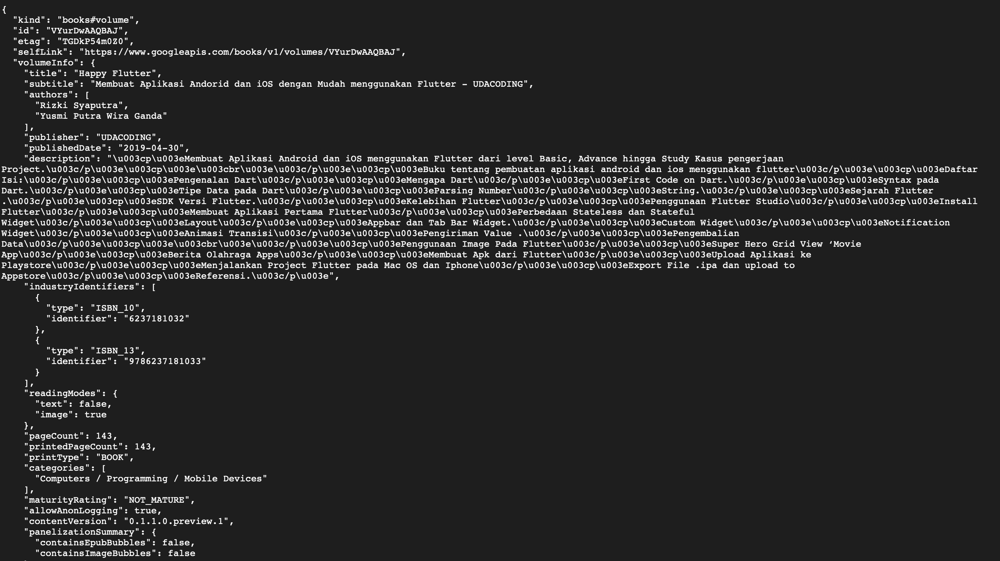
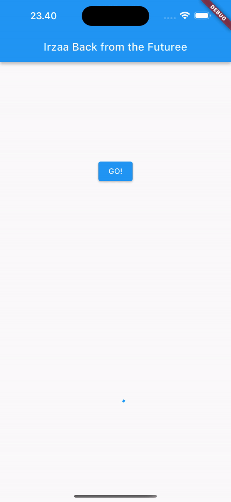
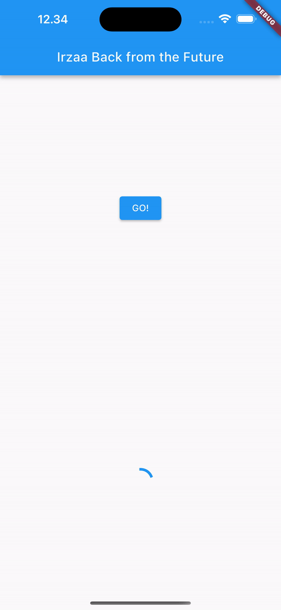
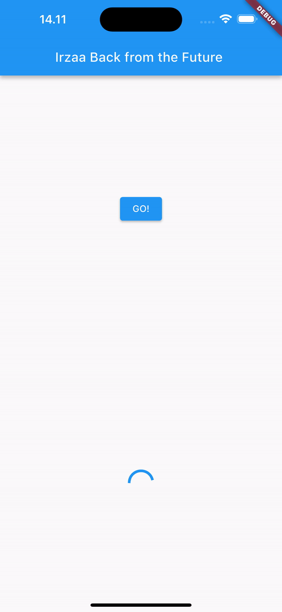
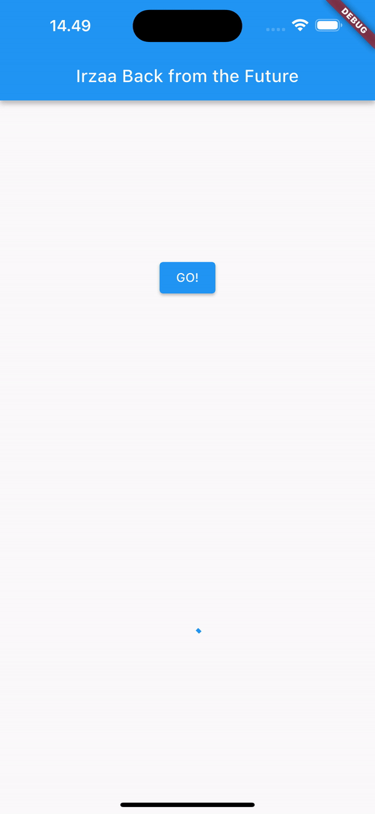

## Nama : Arsyanda Irza Rabbani Yuardhino (06)
## NIM : 2141720245
## Kelas : 3F

# Week 12 - Pemrograman Asynchronous

### Praktikum 1: Mengunduh Data dari Web Service (API)

**Soal 1**

**Tambahkan nama panggilan Anda pada title app sebagai identitas hasil pekerjaan Anda.**

```dart
import 'dart:async';
import 'package:flutter/material.dart';
import 'package:http/http.dart';
import 'package:http/http.dart' as http;

void main() {
  runApp(const MyApp());
}

class MyApp extends StatelessWidget {
  const MyApp({super.key});

  @override
  Widget build(BuildContext context) {
    return MaterialApp(
      title: 'Irzaa Future Demo',
      theme: ThemeData(
        primarySwatch: Colors.blue,
        visualDensity: VisualDensity.adaptivePlatformDensity,
      ),
      home: const FuturePage(),
    );
  }
}

class FuturePage extends StatefulWidget {
  const FuturePage({super.key});

  @override
  State<FuturePage> createState() => _FuturePageState();
}

class _FuturePageState extends State<FuturePage> {
  String result = '';
  @override
  Widget build(BuildContext context) {
    return Scaffold(
      appBar: AppBar(
        title: const Text('Back from the Future'),
      ),
      body: Center(
        child: Column(children: [
          const Spacer(),
          ElevatedButton(
            child: const Text('GO!'),
            onPressed: () {},
          ),
          const Spacer(),
          Text(result),
          const Spacer(),
          const CircularProgressIndicator(),
          const Spacer(),
        ]),
      ),
    );
  }
}

Future<Response> getData() async {
  const authority = 'www.googleapis.com';
  const path = '/books/v1/volumes/VEUFEAAAQBAJ';
  Uri url = Uri.https(authority, path);
  return http.get(url);
}
```

**Soal 2**



**Soal 3**
1. **Jelaskan maksud kode langkah 5 tersebut terkait substring dan catchError!**

#### substring() digunakan untuk mengambil substring dari sebuah string, dimulai dari indeks awal dan berakhir pada indeks akhir yang diberikan, sedangkan catchError() digunakan untuk menangani kesalahan yang terjadi dalam operasi asinkron.

2. **Capture hasil praktikum Anda berupa GIF dan lampirkan di README. Lalu lakukan commit dengan pesan "W12: Soal 3".**


---

# Praktikum 2: Menggunakan await/async untuk menghindari callbacks

### Ada alternatif penggunaan Future yang lebih clean, mudah dibaca dan dirawat, yaitu pola async/await. Intinya pada dua kata kunci ini:

### 1. async digunakan untuk menandai suatu method sebagai asynchronous dan itu harus ditambahkan di depan kode function.

### 2. await digunakan untuk memerintahkan menunggu sampai eksekusi suatu function itu selesai dan mengembalikan sebuah value. Untuk then bisa digunakan pada jenis method apapun, sedangkan await hanya bekerja di dalam method async.

```Dart
import 'package:flutter/material.dart';
import 'dart:async';
import 'package:http/http.dart';
import 'package:http/http.dart' as http;

void main() {
  runApp(const MyApp());
}

class MyApp extends StatelessWidget {
  const MyApp({super.key});

  // This widget is the root of your application.
  @override
  Widget build(BuildContext context) {
    return MaterialApp(
      title: 'Irzaa Future Demo',
      theme: ThemeData(
        primarySwatch: Colors.blue,
        visualDensity: VisualDensity.adaptivePlatformDensity,
      ),
      home: const FuturePage(),
    );
  }
}

class FuturePage extends StatefulWidget {
  const FuturePage({super.key});

  @override
  State<FuturePage> createState() => _FuturePageState();
}

class _FuturePageState extends State<FuturePage> {
  String result = '';
  @override
  Widget build(BuildContext context) {
    return Scaffold(
      appBar: AppBar(
        title: const Text(' Irzaa Back from the Futuree '),
      ),
      body: Center(
        child: Column(
          mainAxisAlignment: MainAxisAlignment.center,
          children: [
            const Spacer(),
            ElevatedButton(
                onPressed: count,
                child: const Text("GO!")),
            const Spacer(),
            Text(result),
            const Spacer(),
            const CircularProgressIndicator(),
            const Spacer()
          ],
        ),
      ),
    );
  }

  Future<Response> getData() async {
    const authority = 'www.googleapis.com';
    const path = '/books/v1/volumes/VEUFEAAAQBAJ';
    Uri url = Uri.https(authority, path);
    return await http.get(url);
  }

  Future<int> returnOneAsync() async {
    await Future.delayed(const Duration(seconds: 3));
    return 1;
  }

  Future<int> returnTwoAsync() async {
    await Future.delayed(const Duration(seconds: 3));
    return 2;
  }

  Future<int> returnThreeAsync() async {
    await Future.delayed(const Duration(seconds: 3));
    return 3;
  }

  Future count() async {
    int total = 0;
    total = await returnOneAsync();
    total += await returnTwoAsync();
    total += await returnThreeAsync();
    setState(() {
      result = total.toString();
    });
  }
}
```



# Soal 4

1. **Jelaskan maksud kode langkah 1 dan 2 tersebut!**

Pada langkah 1, dilakukan penambahan tiga method baru dalam kelas `_FuturePageState`. Metode-metode ini, yaitu `returnOneAsync`, `returnTwoAsync`, dan  `returnThreeAsync`, sebenarnya melakukan operasi asinkron yang mensimulasikan penundaan selama 3 detik dan mengembalikan nilai 1, 2, dan 3 secara berturut-turut.

Pada langkah 2, dilakukan penambahan method `count`. Method ini memiliki tiga pemanggilan fungsi asinkron `(await)` ke metode-metode yang telah ditambahkan sebelumnya. Method `count` menghitung jumlah total dari hasil yang dikembalikan oleh metode-metode asinkron dan kemudian mengatur nilai `result` dalam state untuk menampilkan hasilnya.


# **Praktikum 3: Menggunakan Completer di Future**

### Menggunakan Future dengan then, catchError, async, dan await mungkin sudah cukup untuk banyak kasus, tetapi ada alternatif melakukan operasi async di Dart dan Flutter yaitu dengan class Completer.

Completer membuat object Future yang mana Anda dapat menyelesaikannya nanti (late) dengan return sebuah value atau error.
```Dart
import 'package:flutter/material.dart';
import 'dart:async';
import 'package:http/http.dart';
import 'package:http/http.dart' as http;
import 'package:async/async.dart';

void main() {
  runApp(const MyApp());
}

class MyApp extends StatelessWidget {
  const MyApp({super.key});

  // This widget is the root of your application.
  @override
  Widget build(BuildContext context) {
    return MaterialApp(
      title: 'Flutter Demo Irzaa',
      theme: ThemeData(
        primarySwatch: Colors.blue,
        visualDensity: VisualDensity.adaptivePlatformDensity,
      ),
      home: const FuturePage(),
    );
  }
}

class FuturePage extends StatefulWidget {
  const FuturePage({super.key});

  @override
  State<FuturePage> createState() => _FuturePageState();
}

class _FuturePageState extends State<FuturePage> {
  String result = '';
  late Completer completer;

  @override
  Widget build(BuildContext context) {
    return Scaffold(
      appBar: AppBar(
        title: const Text('Irzaa Back from the Future'),
      ),
      body: Center(
        child: Column(
          mainAxisAlignment: MainAxisAlignment.center,
          children: [
            const Spacer(),
            ElevatedButton(
              onPressed: () {
                getNumber().then((value) {
                  setState(() {
                    result = value.toString();
                  });
                }).catchError((e) {
                  result = 'An error Occured';
                });
              },
              child: const Text("GO!"),
            ),
            const Spacer(),
            Text(result),
            const Spacer(),
            const CircularProgressIndicator(),
            const Spacer()
          ],
        ),
      ),
    );
  }

  Future getNumber() {
    completer = Completer<int>();
    calculate();
    return completer.future;
  }

  calculate() async {
    try {
      await Future.delayed(const Duration(seconds: 5));
      completer.complete(42);
    } catch (e) {
      completer.completeError({});
    }
  }

  Future<Response> getData() async {
    const authority = 'www.googleapis.com';
    const path = '/books/v1/volumes/VEUFEAAAQBAJ';
    Uri url = Uri.https(authority, path);
    return await http.get(url);
  }

  Future<int> returnOneAsync() async {
    await Future.delayed(const Duration(seconds: 3));
    return 1;
  }

  Future<int> returnTwoAsync() async {
    await Future.delayed(const Duration(seconds: 3));
    return 2;
  }

  Future<int> returnThreeAsync() async {
    await Future.delayed(const Duration(seconds: 3));
    return 3;
  }

  Future count() async {
    int total = 0;
    total = await returnOneAsync();
    total += await returnTwoAsync();
    total += await returnThreeAsync();
    setState(() {
      result = total.toString();
    });
  }
}
```


## **Soal 5**

-  **Jelaskan maksud kode langkah 2 tersebut!**

Baris kedua kode tersebut memberikan penjelasan tentang konsep `Completer` di Flutter. Pertama, deklarasikan variabel `completer` sebagai `late Completer`artinya, nilainya akan diinisialisasi sebelum digunakan. Terakhir, ada dua metode yang diterapkan.

Metode pertama, `getNumber`, bertanggung jawab untuk membuat `Completer`. Setelah itu, metode lain, `calculate`, dihubungkan.

Metode kedua menggunakan `await Future.delayed(...)` untuk menunda selama lima detik untuk mensimulasikan operasi yang membutuhkan waktu. Setelah itu, nilai `completer` dipenuhi dengan angka 42, yang menunjukkan bahwa operasi telah selesai.

## **Soal 6**

-  **Jelaskan maksud perbedaan kode langkah 2 dengan langkah 5-6 tersebut!**

Pada langkah 5 mengubah metode `calculate` dengan menambahkan blok `try-catch`. Jika terjadi kesalahan selama operasi asinkron, blok `catch` akan menangkap kesalahan tersebut, dan `completer` akan diselesaikan dengan sebuah objek kosong `{}`. Langkah 6 adalah bagian dari fungsi `onPressed` pada tombol "GO!" yang memanggil metode `getNumber`. Pada langkah ini, setelah pemanggilan `getNumber`, `then` digunakan untuk menangkap hasilnya. Dalam blok `then`, nilai hasil dikonversi menjadi string dan diperbarui ke dalam variabel `result` melalui `setState`. Jika ada kesalahan, `catchError` akan menangkapnya dan mengatur `result` ke string "An error Occurred".


# **Praktikum 4: Memanggil Future secara paralel**

### Ketika Anda membutuhkan untuk menjalankan banyak Future secara bersamaan, ada sebuah class yang dapat Anda gunakan yaitu: FutureGroup.

### FutureGroup adalah sekumpulan dari Future yang dapat run secara paralel. Ketika run secara paralel, maka konsumsi waktu menjadi lebih hemat (cepat) dibanding run method async secara single setelah itu method async lainnya.

### Ketika semua code async paralel selesai dieksekusi, maka FutureGroup akan return value sebagai sebuah List, sama juga ketika ingin menambahkan operasi paralel dalam bentuk List.


```Dart
import 'package:flutter/material.dart';
import 'dart:async';
import 'package:http/http.dart';
import 'package:http/http.dart' as http;
import 'package:async/async.dart';

void main() {
  runApp(const MyApp());
}

class MyApp extends StatelessWidget {
  const MyApp({super.key});

  // This widget is the root of your application.
  @override
  Widget build(BuildContext context) {
    return MaterialApp(
      title: 'Flutter Demo Irzaa',
      theme: ThemeData(
        primarySwatch: Colors.blue,
        visualDensity: VisualDensity.adaptivePlatformDensity,
      ),
      home: const FuturePage(),
    );
  }
}

class FuturePage extends StatefulWidget {
  const FuturePage({super.key});

  @override
  State<FuturePage> createState() => _FuturePageState();
}

class _FuturePageState extends State<FuturePage> {
  String result = '';
  late Completer completer;

  @override
  Widget build(BuildContext context) {
    return Scaffold(
      appBar: AppBar(
        title: const Text('Irzaa Back from the Future '),
      ),
      body: Center(
        child: Column(
          mainAxisAlignment: MainAxisAlignment.center,
          children: [
            const Spacer(),
            ElevatedButton(
              onPressed: returnFG,
              child: const Text("GO!"),
            ),
            const Spacer(),
            Text(result),
            const Spacer(),
            const CircularProgressIndicator(),
            const Spacer()
          ],
        ),
      ),
    );
  }

  Future getNumber() {
    completer = Completer<int>();
    calculate();
    return completer.future;
  }

  calculate() async {
    try {
      await Future.delayed(const Duration(seconds: 5));
      completer.complete(42);
    } catch (e) {
      completer.completeError({});
    }
  }

  void returnFG() {
    final futures = Future.wait<int>([
      returnOneAsync(),
      returnTwoAsync(),
      returnThreeAsync(),
    ]);
     FutureGroup<int> futureGroup = FutureGroup<int>();
     futureGroup.add(returnOneAsync());
     futureGroup.add(returnTwoAsync());
     futureGroup.add(returnThreeAsync());
     futureGroup.close(); 
    futures.then((value) {
      int total = 0;
      for (var element in value) {
        total += element;
      }
      setState(() {
        result = total.toString();
      });
    });
  }

  Future<Response> getData() async {
    const authority = 'www.googleapis.com';
    const path = '/books/v1/volumes/VEUFEAAAQBAJ';
    Uri url = Uri.https(authority, path);
    return await http.get(url);
  }

  Future<int> returnOneAsync() async {
    await Future.delayed(const Duration(seconds: 3));
    return 1;
  }

  Future<int> returnTwoAsync() async {
    await Future.delayed(const Duration(seconds: 3));
    return 2;
  }

  Future<int> returnThreeAsync() async {
    await Future.delayed(const Duration(seconds: 3));
    return 3;
  }

  Future count() async {
    int total = 0;
    total = await returnOneAsync();
    total += await returnTwoAsync();
    total += await returnThreeAsync();
    setState(() {
      result = total.toString();
    });
  }
}

```

## **Soal 7**

-  **Capture hasil praktikum Anda berupa GIF dan lampirkan di README. Lalu lakukan commit dengan pesan "W12: Soal 7".**

#### Anda akan melihat hasilnya dalam 3 detik berupa angka 6 lebih cepat dibandingkan praktikum sebelumnya menunggu sampai 9 detik.



## **Soal 8**

-  **Jelaskan maksud perbedaan kode langkah 1 dan 4!.**

Langkah 1, menggunakan objek `FutureGroup` untuk mengelola sekelompok `Future`. Setiap `Future` ditambahkan ke dalam `FutureGroup` menggunakan methode `add`. Selanjutnya, method `close` dipanggil untuk menandai akhir dari grup `Future`. Setelah itu, `FutureGroup.future` digunakan untuk mendapatkan `Future` tunggal yang menunggu kelompok `Future` selesai. Kemudian, hasil dari setiap `Future` dijumlahkan untuk menghitung total, dan hasilnya diperbarui dalam UI melalui penggunaaan  `setState`.

Sedangkan pada langkah 4, digunakan fungsi `Future.wait` untuk menunggu sejumlah `Future` selesai. Daftar `Future` yang akan ditunggu diatur dalam bentuk `list`, dan `Future.wait` secara langsung menunggu semua `Future` dalam `list` selesai. Setelah itu, hasil dari setiap `Future` dijumlahkan untuk menghitung total, dan hasilnya diperbarui dalam UI melalui `setState`.

Perbedaan utama antara keduanya terletak pada cara mengelola dan menunggu kelompok `Future`. Langkah 1 menggunakan objek `FutureGroup`, sedangkan Langkah 4 langsung menggunakan `Future.wait` untuk menangani beberapa `Future` secara bersamaan. Langkah 4 dapat dianggap lebih langsung dan mudah dipahami, sementara Langkah 1 menunjukkan pendekatan yang lebih modular dengan penggunaan objek `FutureGroup`.


# **Praktikum 5: Menangani Respon Error pada Async Code**

### Ada beberapa teknik untuk melakukan handle error pada code async. Pada praktikum ini Anda akan menggunakan 2 cara, yaitu then() callback dan pola async/await.

## **Soal 9**

-  **Capture hasil praktikum Anda berupa GIF dan lampirkan di `README`. Lalu lakukan commit dengan pesan "W12: Soal 9".**



## **Soal 10**

- Panggil method `handleError()` tersebut di `ElevatedButton`, lalu run. Apa hasilnya? Jelaskan perbedaan kode langkah 1 dan 4!

Setelah method `handleError()` dipanggil, maka outputnya akan tetap sama yaitu pesan kesalahan **'Exception: Something terrible happened!'** akan tetap ditampilkan. Namun kedua kode pada langkah 1 dan 4 tersebut memiliki perbedaan dalam menangani error yang terjadi.

Pada langkah 1, meskipun method `returnError()` melemparkan pengecualian, tidak ada blok `try-catch` di sekitarnya. Oleh karena itu, ketika memanggil `returnError()`, pengecualian akan diteruskan tanpa ditangani. Ini dapat menyebabkan aplikasi berhenti atau menampilkan pesan kesalahan tanpa penanganan khusus.

Pada langkah 4, method `handleError()` akan mengeksekusi `returnError()` dalam blok `try`. Jika ada kesalahan selama eksekusi `returnError()`, blok `catch` akan dijalankan, dan pesan kesalahan akan diperbarui dalam `setState`. Oleh karena itu, setelah pemanggilan `handleError()`, meskipun pesan kesalahan tetap sama, aplikasi dapat melanjutkan berjalan karena penanganan kesalahan yang dilakukan di dalam blok `catch`.


# **Praktikum 6: Menggunakan Future dengan StatefulWidget**

- Seperti yang Anda telah pelajari, Stateless widget tidak dapat menyimpan informasi (state), StatefulWidget dapat mengelola variabel dan properti dengan method setState(), yang kemudian dapat ditampilkan pada UI. State adalah informasi yang dapat berubah selama life cycle widget itu berlangsung.

##### Ada 4 method utama dalam life cycle StatefullWidget:

- initState(): dipanggil sekali ketika state dibangun. Bisa dikatakan ini juga sebagai konstruktor class.

- build(): dipanggil setiap kali ada perubahan state atau UI. Method ini melakukan destroy UI dan membangun ulang dari nol.

- deactive() dan dispose(): digunakan untuk menghapus widget dari tree, pada beberapa kasus dimanfaatkan untuk menutup koneksi ke database atau menyimpan data sebelum berpindah screen.

---

## **Soal 11**

- Tambahkan nama panggilan Anda pada tiap properti title sebagai identitas pekerjaan Anda.


---

## **Soal 12**

- Jika Anda tidak melihat animasi loading tampil, kemungkinan itu berjalan sangat cepat. Tambahkan delay pada method getPosition() dengan kode await Future.delayed(const Duration(seconds: 3));

- Apakah Anda mendapatkan koordinat GPS ketika run di browser? Mengapa demikian?
> Karena Flutter web menggunakan API Geolocation langsung dari browser. Pada Flutter web, izin untuk mengakses lokasi dikelola oleh browser, bukan oleh sistem operasi (seperti Android pada perangkat seluler). Oleh karena itu, meskipun tidak menambahkan izin secara langsung ke `AndroidManifest`, koordinat GPS masih dapat diperoleh di browser, tetapi tetap memerlukan izin dari pengguna.


### Praktikum 7: Manajemen Future dengan FutureBuilder

## **Soal 13**

- Apakah ada perbedaan UI dengan praktikum sebelumnya? Mengapa demikian?
> Tidak ada perbedaan UI dengan praktikum sebelumnya, keduanya tetap menampilkan koordinat Geolokasi dengan layout yang sama karena keduanya masih mengambil lokasi secara sinkron dalam blok `initState`.


