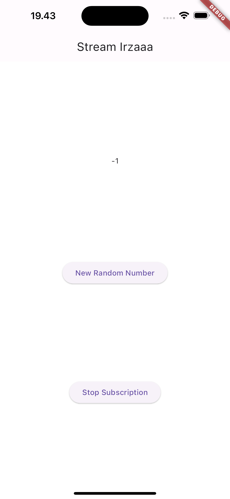
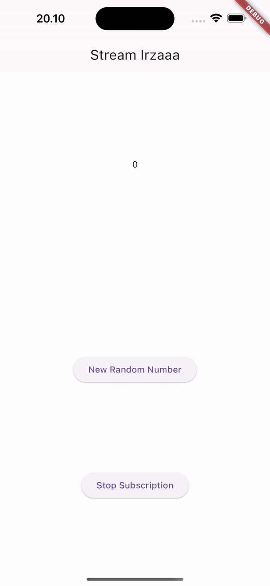

## Nama : Arsyanda Irza Rabbani Yuardhino (06)
## NIM : 2141720245
## Kelas : 3F

<br>
<br>

# Week 13 - Lanjutan State Management dengan Streams

### Praktikum 1: Dart Streams


**Soal 1**

- Tambahkan nama panggilan Anda pada title app sebagai identitas hasil pekerjaan Anda.
- Gantilah warna tema aplikasi sesuai kesukaan Anda.
- Lakukan commit hasil jawaban Soal 1 dengan pesan "W13: Jawaban Soal 1"

```dart
import 'package:flutter/material.dart';

void main() {
  runApp(const MyApp());
}

class MyApp extends StatelessWidget {
  const MyApp({super.key});

  @override
  Widget build(BuildContext context) {
    return MaterialApp(
      title: 'Stream Irzaa',
      theme: ThemeData(
        primarySwatch: Colors.blue,
      ),
      home: const StreamHomePage(),
    );
  }
}

class StreamHomePage extends StatefulWidget {
  const StreamHomePage({super.key});

  @override
  State<StreamHomePage> createState() => _StreamHomePageState();
}

class _StreamHomePageState extends State<StreamHomePage> {
  @override
  Widget build(BuildContext context) {
    return Container();
  }
}

```
**Soal 2**

- Tambahkan 5 warna lainnya sesuai keinginan Anda pada variabel colors tersebut.
- Lakukan commit hasil jawaban Soal 2 dengan pesan "W13: Jawaban Soal 2"

```dart
import 'package:flutter/material.dart';

class ColorStream {
  final List<Color> colors = [
  Colors.red,
  Colors.yellow,
  Colors.blue,
  Colors.green,
  Colors.teal,
];

}

```

**Soal 3**

- Jelaskan fungsi keyword yield* pada kode tersebut!
> Keyword 'yield*' digunakan dalam metode getColors() dari kelas ColorStream untuk mendelegasikan pembuatan warna ke generator lain. 'yield*' digunakan untuk mendelegasikan pembuatan warna ke generator Stream.periodic().

- Apa maksud isi perintah kode tersebut?
> Untuk menjelaskan fungsi keyword yield* pada kode yang diberikan. Kode tersebut mendefinisikan kelas ColorStream yang memiliki metode getColors(). Metode getColors() menghasilkan aliran warna yang berubah setiap detik. Warna yang dihasilkan dipilih dari daftar warna yang disimpan dalam properti colors.

**Soal 4**

- Capture hasil praktikum Anda berupa GIF dan lampirkan di README.


**Soal 5**

- Jelaskan perbedaan menggunakan listen dan await for (langkah 9) !
> 'await' digunakan untuk mengambil nilai asinkron secara berurutan dalam suatu loop, sementara 'listen' digunakan untuk mendaftarkan fungsi yang akan dipanggil setiap kali ada perubahan dalam stream tanpa menghentikan eksekusi program.

- Lakukan commit hasil jawaban Soal 5 dengan pesan "W13: Jawaban Soal 5"

### Praktikum 2: Stream controllers dan sinks
**Soal 6**
- Jelaskan maksud kode langkah 8 dan 10 tersebut!  
  jawab :  
  `langkah 8` : pertama-tama, sebuah instance dari NumberStream diciptakan untuk menginisialisasi stream controller dan sink-nya. stream kemudian diambil dari controller dengan menggunakan numberStreamController.stream. Kemudian, listen digunakan pada stream untuk mendengarkan perubahan yang terjadi pada Stream. Ketika ada perubahan (saat angka baru ditambahkan ke dalam Stream), fungsi yang diberikan akan dipanggil. Di sini, nilai yang diterima dari Stream akan diperbarui dalam state dengan menggunakan setState, dan nilai terakhir lastNumber akan diperbarui dengan nilai dari Stream.  
  `langkah 10` : addRandomNumber() method yang bertujuan untuk menambahkan angka acak ke dalam Stream. Pertama, sebuah objek dari kelas Random diciptakan untuk menghasilkan angka acak. Kemudian, angka acak di-generate menggunakan nextInt(10) untuk mendapatkan angka random dari 0 hingga 9. Terakhir, angka tersebut ditambahkan ke dalam Sink yang ada di numberStream melalui method addNumberToSink().
- Capture hasil praktikum Anda berupa GIF dan lampirkan di README.  


**Soal 7**
- Jelaskan maksud kode langkah 13 sampai 15 tersebut!  
  jawab :  
  ```dart
  //langkah 13
  addError() {
    controller.sink.addError('error');
  }
  ``` 
  digunakan untuk mengirimkan pesan error (dalam hal ini, pesan 'error') ke dalam sink dari suatu Stream, sehingga Stream akan menghasilkan error tersebut. Ini berguna untuk memberi tahu penerima Stream bahwa terjadi kesalahan atau kondisi yang tidak diharapkan dalam aliran data.  

  ---
  ```dart
  //langkah 14
  .onError((error) {
      setState(() {
        lastNumber = -1;
      });
    });
  ```
  onError() adalah bagian dari penanganan kesalahan pada Stream, dipanggil ketika error terjadi dalam aliran data. Dalam contoh tersebut, ketika error terdeteksi, fungsi yang disediakan akan dijalankan, menggunakan setState() untuk memperbarui nilai terakhir lastNumber dengan nilai -1, memberikan penanda bahwa terdapat kesalahan dalam aliran data yang dikirimkan melalui Stream.  

  ---
  ```dart
  //langkah 15
   numberStream.addError();
  ```
  digunakan untuk menambahkan sebuah error ke dalam Stream. Dalam konteks ini, ketika metode ini dipanggil, ia akan mengirimkan pesan error ke dalam sink yang terkait dengan Stream, memicu operasi .onError() yang telah ditentukan sebelumnya. Ini memungkinkan kode yang menangani error (seperti dalam .onError()) untuk dijalankan, memberikan kesempatan untuk menangani kondisi error yang muncul dalam aliran data Stream.  

- Kembalikan kode seperti semula pada Langkah 15, comment addError() agar Anda dapat melanjutkan ke praktikum 3 berikutnya.  
  ```dart
  void addRandomNumber() {
    Random random = Random();
    int myNum = random.nextInt(10);
    numberStream.addNumberToSink(myNum);
    // numberStream.addError();
  }
  ```

  ### Praktikum 3: Injeksi data ke streams
 **Soal 8**
- Jelaskan maksud kode langkah 1-3 tersebut!  
  jawab : 
  - langkah 1
  ```dart
  late StreamTransformer transformer;
  ```
  deklarasi variabel yang akan digunakan sebagai objek StreamTransformer. Penggunaan kata kunci late memungkinkan kita untuk menunda inisialisasi variabel hingga saat yang tepat sebelum penggunaannya dalam program.  

  - langkah 2
  ```dart
  transformer = StreamTransformer<int, int>.fromHandlers(
        handleData: (value, sink) {
          sink.add(value * 10);
        },
        handleError: (error, trace, sink) {
          sink.add(-1);
        },
        handleDone: (sink) => sink.close());
  ```
  memberikan nilai pada variabel transformer, yaitu sebuah objek StreamTransformer yang akan mengubah data yang melewati stream. Melalui metode fromHandlers(), kita menentukan cara menangani data yang diterima dari stream tersebut. Dalam kasus ini, kita mendefinisikan perilaku ketika ada data yang masuk, ketika terjadi kesalahan, dan ketika stream selesai.  
  
  - langkah 3
  ```dart
  stream.transform(transformer).listen((event) {
      setState(() {
        lastNumber = event;
      });
    }).onError((error) {
      setState(() {
        lastNumber = -1;
      });
    });
  ```
  menerapkan transformer yang sebelumnya ke dalam stream menggunakan metode transform(). Transformer ini akan mengubah data yang mengalir melalui stream sebelumnya. Kemudian, dengan menggunakan listen(), kita mulai mendengarkan (listen) stream yang sudah diubah. Di dalamnya, kita menentukan bagaimana aplikasi harus menangani data yang masuk ke dalam stream tersebut, serta bagaimana menangani kesalahan yang mungkin muncul selama proses tersebut.  

- Capture hasil praktikum Anda berupa GIF dan lampirkan di README.  


## Praktikum 4: Subscribe ke stream events

**Soal 9**
- Jelaskan maksud kode langkah 2, 6 dan 8 tersebut!  
  jawab :  
  - langkah 2  
  ```dart
  numberStream = NumberStream();
  numberStreamController = numberStream.controller;
  Stream stream = numberStreamController.stream;
  subscription = stream.listen((event) {
      setState(() {
        lastNumber = event;
      });
    });
  ```  
  membuat sebuah objek NumberStream, kemudian mengakses controller dari objek tersebut untuk mengontrol stream yang dihasilkan. Selanjutnya, mendapatkan stream dari numberStreamController yang merupakan aliran data yang dapat didengarkan. Kemudian, menggunakan metode listen() pada stream untuk mulai mendengarkan nilai-nilai yang masuk ke dalam stream tersebut. Ketika ada data baru yang masuk, setState() digunakan untuk memperbarui nilai lastNumber dengan nilai terbaru dari stream.  

  - langkah 6  
  ```dart
  void dispose() {
    numberStreamController.close();
    subscription.cancel();
    super.dispose();
  }
  ```  
  numberStreamController.close() digunakan untuk menutup controller stream, menghentikan pengiriman data ke dalam stream. Selanjutnya, subscription.cancel() digunakan untuk membatalkan langganan (subscription) terhadap stream yang telah dibuat sebelumnya. Hal ini penting untuk memastikan bahwa tidak ada langganan yang tersisa yang dapat menyebabkan memory leak atau masalah sumber daya lainnya setelah widget atau halaman dihapus.  

  - langkah 8  
  ```dart
  void addRandomNumber() {
    Random random = Random();
    int myNum = random.nextInt(10);
    if (!numberStreamController.isClosed) {
      numberStream.addNumberToSink(myNum);
    } else {
      setState(() {
        lastNumber = -1;
      });
    }
  }
  ```
  addRandomNumber() digunakan untuk menambahkan nomor acak ke dalam stream menggunakan objek Random untuk mendapatkan nomor acak antara 0 hingga 9. Selanjutnya, memeriksa apakah numberStreamController sudah ditutup (isClosed). Jika controller stream masih terbuka, maka menggunakan numberStream.addNumberToSink(myNum) untuk menambahkan nomor acak ke dalam stream. Namun, jika controller stream sudah tertutup, maka setState() digunakan untuk mengubah nilai lastNumber menjadi -1, yang menunjukkan bahwa ada masalah dalam menambahkan nomor ke dalam stream yang sudah ditutup.  

- Capture hasil praktikum Anda berupa GIF dan lampirkan di README.  



## Praktikum 5: Multiple stream subscriptions
 **Soal 10**
- Jelaskan mengapa error itu bisa terjadi ?  
  jawab : 
  `StateError (Bad state: Stream has already been listened to.)` karena mencoba untuk mendengarkan (listen) stream yang sama lebih dari sekali secara bersamaan. stream seharusnya unik, jadi ketika dijalankan bersamaan akan terjadi konflik.  

 **Soal 11**
- Jelaskan mengapa hal itu bisa terjadi ?  
  jawab :  
  karena menggunakan `Stream stream = numberStreamController.stream.asBroadcastStream();` sehingga dapat didengarkan oleh beberapa subscriptions secara bersamaan, berbeda dengan stream biasa yang hanya dapat didengarkan sekali. dan setiap subscritions akan menerima data yang sama pada waktu yang bersamaan.  
- Capture hasil praktikum Anda berupa GIF dan lampirkan di README.  
  
 
